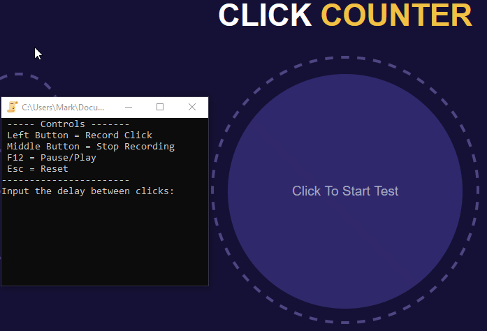

# pressingClicks
This is a program to press clicks given an input routine and loops through.

* Download the latest release of [pressingClicks.exe](https://github.com/marcoagbarreto/pressingClicks/releases/download/v0.1.0/pressingClicks.exe)

## Example

1. Run ```pressingClicks.exe``` or ```pressingClicks.py```
2. Input delay and intervals for clicks and routines.
3. Start clicking the routine actions. Once done click the middle button to save.
4. Make focus on the desired app.
5. Press ```[F12]``` to run the program.
6. Profit.
7. Restart the program with ```[Esc]```



## Code Usage

Clone the repository (no installation required, source files are sufficient):
        
    https://github.com/marcoagbarreto/pressingClicks.git

dependencies:

    import os
    import time
    import random
    import pynput 
    import threading

or [download and extract the zip](https://github.com/marcoagbarreto/pressingClicks/archive/main.zip) into your project folder.

## Known limitations:
* Only left clicks are possible at the moment